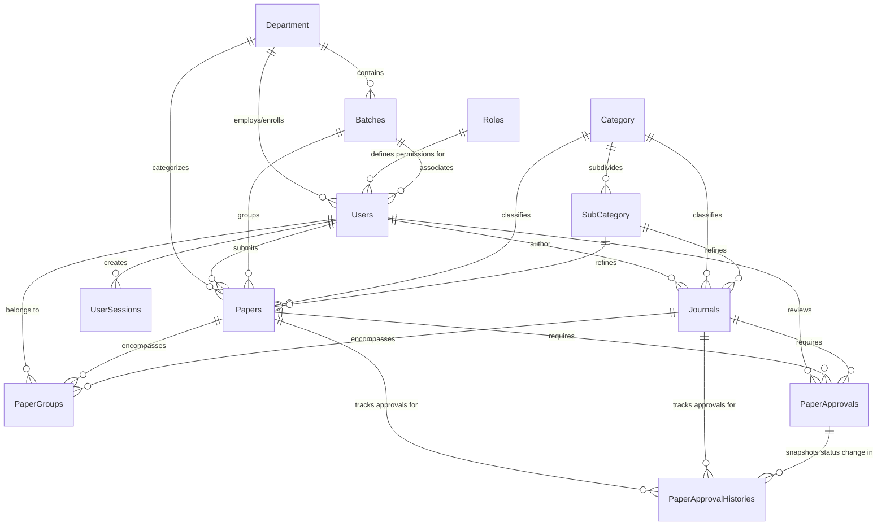
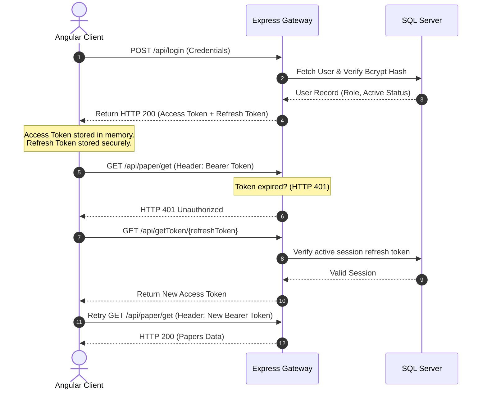
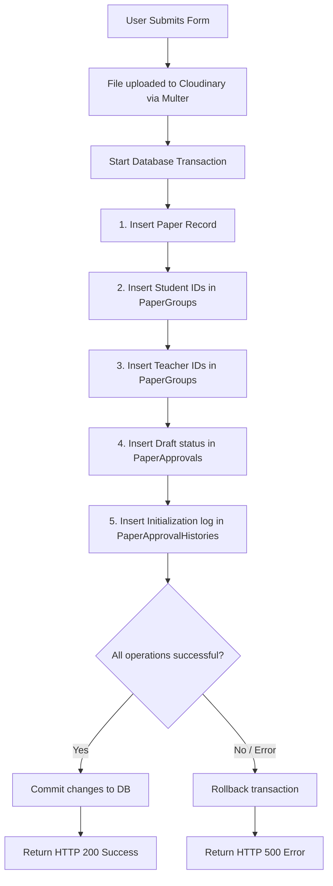
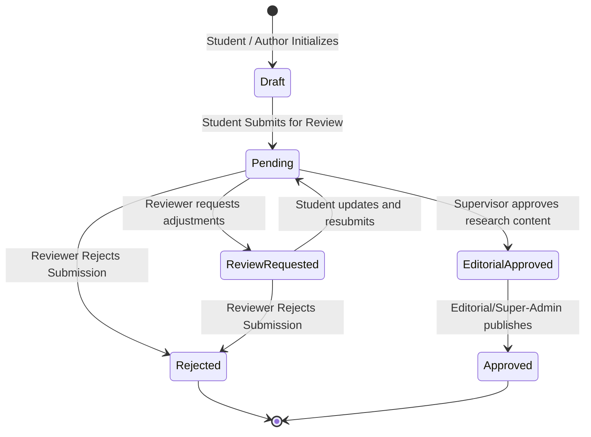
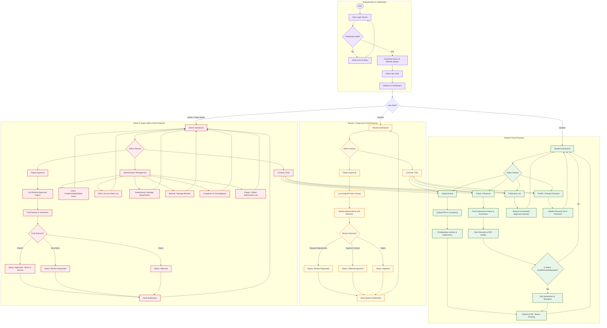
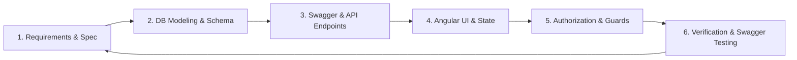

# System Development Methodology
## Gono UV Research Project Repository and Academic Submission System

This document outlines the system development methodology, architecture, database schemas, and workflows implemented for the **Gono UV Research Project Repository and Academic Submission System**. It serves as a comprehensive technical guide detailing how the system is structured, built, secured, and validated.

---

## 1. System Architecture Overview

The system follows a classic **decoupled client-server architecture** (Tier-3 architecture) that separates the presentation layer, the application logic layer, and the data storage layer.

```mermaid
graph TD
    subgraph Client Layer (Presentation)
        Angular[Angular SPA Frontend]
        PrimeNG[PrimeNG UI Components]
        Interceptors[HTTP & Auth Interceptors]
    end

    subgraph Server Layer (Application Logic)
        Express[Express.js TS Server]
        Swagger[Swagger Open API Docs]
        Prisma[Prisma Client ORM]
    end

    subgraph Data & Storage Layer
        SQLServer[(MS SQL Server Database)]
        Cloudinary[Cloudinary Cloud Storage]
    end

    Angular <-->|REST API / JSON| Express
    Express <-->|Prisma Queries| SQLServer
    Express -->|Uploads / Streams| Cloudinary
```

### 1.1 Technical Stack Composition
*   **Presentation Layer (Frontend):** 
    *   **Framework:** Angular (v21.1+) utilizing standalone component architecture and modular route configurations (`admin-routing.module.ts`).
    *   **UI Library:** PrimeNG for highly polished dashboard interfaces, modals, data tables, and input forms.
    *   **Styling:** Custom SCSS variables with modular flexbox layout (`ngx-flexible-layout`).
    *   **Reactive State:** RxJS Observables for asynchronous HTTP routing and data streams.
*   **Application Logic Layer (Backend):**
    *   **Framework:** Node.js with Express.js using TypeScript.
    *   **API Documentation:** Swagger UI (`swagger-ui-express`) rendering OpenAPI 3 schemas to specify and test HTTP requests.
    *   **ORM:** Prisma Client (`@prisma/client`) representing type-safe access to the database.
*   **Data & Storage Layer:**
    *   **Database:** Microsoft SQL Server (configured via Prisma connector).
    *   **Asset Storage:** Cloudinary Cloud Service, integrated via Multer storage engine (`multer-storage-cloudinary`), hosting academic manuscripts (PDFs) and user profile photos.

---

## 2. System Use Case Diagram

The use case diagram describes the behavioral requirements of the system by outlining the interactions between key actors and system functionalities.

```mermaid
graph TD
    %% Define Actors with distinct styling
    subgraph Actors
        Student[Student]
        Teacher[Teacher / Supervisor]
        Admin[Administrator / Super-Admin]
    end

    %% Define Use Cases
    subgraph "System Capabilities"
        UC1(Login & Session Management)
        UC2(Manage Personal Profile)
        UC3(Submit Academic/Research Paper)
        UC4(Select Authors & Supervisor Groups)
        UC5(Track Submission Status & Comments)
        UC6(Review Submission & Leave Remarks)
        UC7(Approve Submission Content)
        UC8(Final Paper/Journal Publication)
        UC9(Manage Users, Roles & Batches)
        UC10(Manage Categories & Subcategories)
    end

    %% Connect Students to Use Cases
    Student --> UC1
    Student --> UC2
    Student --> UC3
    Student --> UC4
    Student --> UC5

    %% Connect Teachers to Use Cases
    Teacher --> UC1
    Teacher --> UC2
    Teacher --> UC5
    Teacher --> UC6
    Teacher --> UC7

    %% Connect Admins to Use Cases
    Admin --> UC1
    Admin --> UC2
    Admin --> UC3
    Admin --> UC4
    Admin --> UC5
    Admin --> UC6
    Admin --> UC7
    Admin --> UC8
    Admin --> UC9
    Admin --> UC10
```



### 2.1 Use Case Summary by Actor

*   **Student (Author):**
    *   Authenticates via JWT login credentials.
    *   Initiates draft submissions by uploading PDF manuscripts (handled through Cloudinary).
    *   Assigns co-authors and supervisors (`PaperGroups` association).
    *   Monitors supervisor reviews, feedback comments, and status notifications.
*   **Teacher (Supervisor / Reviewer):**
    *   Views submitted research manuscripts assigned to their group.
    *   Conducts evaluation, registers comments, and updates statuses (e.g., `Review Requested` or `Editorial Approved`).
*   **Administrator (Admin & Super-Admin):**
    *   Manages core directory data including Departments, Batches, Categories, and Subcategories.
    *   Oversees user identity management and role authorization mapping.
    *   Grants the final `Approved` status to publish papers/journals globally in the repository.

---

## 3. Database Design & Entity Relationship Diagram (ERD)

The database schema is managed using **Prisma Schema** with a relational SQL Server database backend. Relationships are designed to represent student/teacher dynamics, departments, academic batches, categories, and hierarchical research papers/journals.

### 3.1 Entity Relationship Diagram



### 3.2 Table Definitions and Roles

| Table Name | Primary Purpose | Key Fields |
| :--- | :--- | :--- |
| **`Department`** | Represents university academic divisions (e.g., CSE, BBA, Pharmacy). | `Id`, `Name`, `Code`, `IsMarkToDelete` |
| **`Batches`** | Academic student intake groups per department. | `Id`, `Name`, `Year`, `DepartmentId` |
| **`Roles`** | Manages authorization levels (Super-Admin, Admin, Teacher, Student). | `Id`, `Name` |
| **`Users`** | Stores user identity, authentication hashes, and role mappings. | `Id`, `Name`, `Email`, `Password`, `StudentId`, `RoleId` |
| **`UserSessions`** | Stores and tracks active refresh tokens for session prolongation. | `Id`, `UserId`, `RefreshtokenId`, `IsActive` |
| **`Category`** | General scientific research categories. | `Id`, `Name`, `Code` |
| **`SubCategory`** | Highly specialized fields within general research categories. | `Id`, `Name`, `CategoryId` |
| **`Papers`** | Academic thesis and project manuscripts uploaded by students. | `Id`, `Title`, `Abstract`, `FileUrl`, `UserId` |
| **`Journals`** | Published academic research articles. | `Id`, `Title`, `DOI`, `Volume`, `IssueNumber` |
| **`PaperGroups`** | Map of students and guiding teachers associated with a paper/journal. | `Id`, `PaperId`, `UserId`, `UserType` |
| **`PaperApprovals`** | Current verification status (Draft, Pending, Approved, etc.) of a paper. | `Id`, `PaperId`, `Status`, `Remarks` |
| **`PaperApprovalHistories`** | Immutable chronological logs of review notes and approval state changes. | `Id`, `PaperId`, `Status`, `Remarks`, `ApprovedByUser` |

---

## 4. Core Workflow Implementations

### 4.1 Authentication & Request Interception Workflow
The application implements JWT-based stateless authorization secured on the backend via password hashing using `bcrypt` and signature verification using `jsonwebtoken`.



1.  **Auth Interceptor (`auth-interceptor.ts`):** Automatically intercepts outgoing HTTP requests and injects the authorization header `Authorization: Bearer <Token>`.
2.  **Refresh Token Interceptor (`refresh-token-interceptor.ts`):** Listens for `401 Unauthorized` responses. If caught, it locks request queues, calls `/api/getToken/{refreshToken}`, gets a renewed access token, updates local storage, and replays all blocked requests without disrupting the user experience.

### 4.2 Research Paper Creation & Transaction Workflow
When a student creates a paper submission, the backend must atomically insert multiple related entities (the paper, student-author entries, advising teacher mappings, initial approval logs, and historical records). To prevent partial writes or data inconsistencies, the Express server invokes a **Prisma Interactive Transaction** (`prisma.$transaction`).



### 4.3 State Machine for Paper Approvals
The system utilizes a structured state transition policy based on the actor's system role:



*   **Role-Based Constraints:**
    *   **Student:** Can create papers (Draft) and request approval (Pending).
    *   **Teacher/Supervisor:** Evaluates pending submissions, adds comments (`Remarks`), and updates the status to `Review Requested` or `Editorial Approved`.
    *   **Admin/Super-Admin:** Performs final checks on editorial-approved submissions and grants final publication authorization (`Approved` or `Rejected`).

### 4.4 End-to-End System Process Workflow

The following comprehensive process diagram traces the entire user journey: starting from authentication, proceeding through role-based routing (Student, Teacher, Admin/Super-Admin), and listing every core feature and sub-action accessible by each role.



1. **Authentication & Initialization:** Captures user login, token-based session management, and redirection based on role mappings.
2. **Student Pathway:** Enables paper draft creation, Cloudinary upload of manuscripts, assignment of co-authors/supervisors, tracking of approval histories, and updating submissions.
3. **Teacher Pathway:** Allows supervisors to review papers in their group, leave evaluation remarks, and transition approval states.
4. **Admin/Super-Admin Pathway:** Provides global management of system catalogs (Users, Roles, Departments, Batches, Categories, Subcategories) and the final paper publication approval workflow.

---

## 5. Software Development Life Cycle (SDLC) Methodology

To execute the project successfully, the development cycle is structured into six iterative stages (Agile Methodology):



1.  **Requirements & Specifications:** Setting up the roles (Super-Admin, Admin, Teacher, Student) and defining what academic records are required.
2.  **Database Modeling & Schema Design:** Creating the prisma model files and syncing migrations with local Microsoft SQL Server instances.
3.  **API Construction:** Building Express handlers. For every route group, swagger specs are updated inside `swagger.ts` to allow live API testing during integration.
4.  **UI & Interceptor Development:** Developing Angular components matching the route targets (`/dashboard/papers`, `/dashboard/papers-approval`, etc.), integrating PrimeNG components for tabular data rendering.
5.  **Authorization & Security:** Implementing password hashing, JSON Web Tokens validation, route guards, and HTTP interceptors.
6.  **Verification and Quality Checks:** Ensuring validation rules, lint guidelines (using `scripts/enforce-naming.js`), and test validation.

---

## 6. System Verification & Verification Plan

Verification ensures that the application operates reliably and meets security specifications.

### 6.1 Swagger UI Testing
All endpoints are verified using Swagger at `http://localhost:3000/api-docs`. 
*   **Security verification:** Endpoints tagged with authentication restrictions (e.g. `POST /api/subcategories/create`) return a `401 Unauthorized` without a valid Bearer token.
*   **Response validity:** Verifies request payload structures conform to TypeScript models defined in `src/app/fds-config/entity-models/`.

### 6.2 Naming and Architecture Linting
The workspace includes a naming enforcement script (`scripts/enforce-naming.js`) executed using:
```bash
npm run fix-naming
```
This utility scans code resources and ensures naming conventions across folders, selectors, and routes are followed consistently, preventing regressions.

### 6.3 Local Development Verification
To execute and verify the application environment concurrently:
1.  **Backend Startup:** Run the database migrations and start the Node Express server.
    ```bash
    npm run dev
    ```
2.  **Frontend Startup:** Start the Angular development server.
    ```bash
    npm start
    ```
3.  **UI Access:** Navigate to `http://localhost:4200` to execute user acceptance testing (UAT) across Student, Teacher, and Administrator roles.
